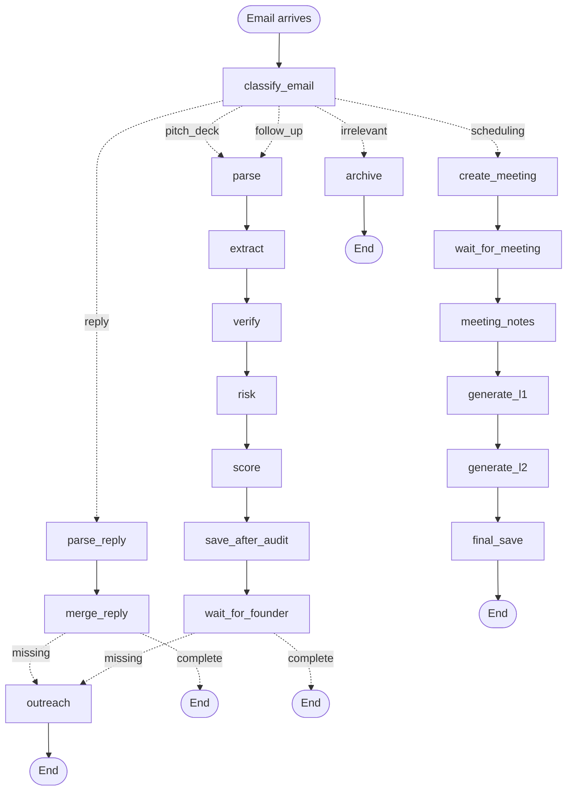

# SafeDeck — LangGraph v2 Architecture

This document describes the v2 orchestrator architecture. It replaces the CrewAI chained-task pipeline that was deployed in v1.

## Why a new architecture?

The v1 architecture (CrewAI) treated each audit as a single pipeline run: PDF → parse → 5 agents → DDB. This broke down in two ways:

1. **No deal state**: A "deal" is long-lived (from first email to "funded" or "passed"), but the pipeline only ran once per email. State lived in the database, but the logic didn't track it.
2. **Chained-task brittleness**: CrewAI's chained context was dropping extraction results. With 49 fields in a 90KB deck, the extraction agent would silently return empty.
3. **Email-driven, not PDF-driven**: The architecture assumed PDFs, but in reality the system gets emails — some with PDFs, some without, some with replies, some with meeting links.

The v2 architecture treats **email as the trigger** and **deal state** as the unit of work. The orchestrator handles the full deal lifecycle.

## High-level structure



## Node responsibilities

| Node | What it does | Output |
|------|--------------|--------|
| `classify_email` | LLM decides email type: `pitch_deck` \| `reply` \| `follow_up` \| `scheduling` \| `irrelevant` | `state.email_classification` |
| `parse` | LlamaParse the PDF (text + OCR for images) | `state._deck_text` |
| `extract` | Direct Gemini call: 49 fields from deck + email body | `state.extracted_deck_data` |
| `verify` | For each non-pitch_deck field, Serper search for source | `state.internet_verified_data`, `state.missing_fields` |
| `risk` | Gemini reasoning on red/green flags | `state.risk_analysis` |
| `score` | Apply VC's rating criteria (weights) | `state.scoring` |
| `save_after_audit` | DDB write | (side effect) |
| `parse_reply` | Parse founder's reply for structured info | (parsed fields) |
| `merge_reply` | Merge into existing deal state | `state.extracted_deck_data` updated |
| `outreach` | Send founder email asking for missing fields | `state.pending_actions` |
| `wait_for_founder` | Suspend until next email from founder arrives | (resumed by webhook) |
| `create_meeting` | Calendly integration | `state.meeting_id` |
| `wait_for_meeting` | Suspend until meeting + Fireflies notes | (resumed by webhook) |
| `meeting_notes` | Receive Fireflies transcript | `state.meeting_transcript` |
| `generate_l1` | Fill L1 template with deal data | `state.l1_note_path` |
| `generate_l2` | Fill L2 template (term sheet) with deal data | `state.l2_note_path` |
| `final_save` | DDB write (final state) | (side effect) |
| `archive` | Mark as terminal state | (log) |

## State machine

Each deal has a `stage` field that tracks its position in the lifecycle:

```
new
  ↓
classifying
  ↓
extracting (pitch_deck path)
  ↓
verifying
  ↓
analyzing_risk
  ↓
awaiting_decision
  ├─ missing fields → awaiting_info
  │   ↓ (founder responds)
  │   info_received
  │     ↓
  │   extracting (loop)
  └─ complete → [VC reviews on frontend]
        ↓
  meeting_scheduled (if advance)
    ↓
  meeting_done
    ↓
  deciding
    ↓
  generating_l1 → generating_l2
    ↓
  funded | passed
```

## Why these specific design choices?

**Why LangGraph over CrewAI?**
- Explicit control flow. No "magic" agent chaining.
- Built-in conditional edges for routing by email type / missing fields.
- Built-in state persistence (so we can suspend/resume on webhooks).
- Same LLM APIs underneath. We use Gemini the same way.

**Why direct Gemini for extraction?**
CrewAI's chained-task context was the root cause of the silent extraction failures. A single direct API call is more reliable, faster, and cheaper. See `apps/agents/src/safedeck/extraction.py`.

**Why operator.add on pending_actions?**
Multiple nodes may want to queue actions (outreach + notify VC + archive). The reducer ensures all actions are accumulated rather than overwritten. See `DealState.pending_actions` and the Annotated type.

**Why typed DealState instead of dict?**
The orchestrator must handle many types (emails, fields, risk flags, scores, notes). Typed state means errors are caught at graph compile time, not at runtime.

## Implementation status

| Component | Status | Notes |
|-----------|--------|-------|
| `state.py` (DealState) | ✅ Done | Typed dict with reducers |
| `__init__.py` (graph) | ✅ Done | 19 nodes, conditional routing |
| `nodes.py` (stubs) | ✅ Done | 13 nodes, NotImplementedError |
| `extract_node` (uses Phase 1 direct call) | ⏳ TODO | Wire up the direct Gemini call |
| `verify_node` | ⏳ TODO | Serper integration per field |
| `risk_node` | ⏳ TODO | Direct Gemini or CrewAI |
| `score_node` | ⏳ TODO | Apply rating criteria |
| `l1_node`, `l2_node` | ⏳ TODO | docxtpl template filling |
| `outreach_node` | ⏳ TODO | Gmail API |
| `meeting_node` | ⏳ TODO | Calendly API |
| `meeting_notes_node` | ⏳ TODO | Fireflies webhook |

## Tests

`tests/test_graph.py` covers:
- Graph structure (nodes + edges)
- State initialization
- Conditional routing (email type, missing fields)
- Reducers (operator.add on pending_actions)
- Compilation

**91 tests passing total** (85 from before + 6 new graph tests).

## Migration plan

The v2 architecture replaces v1 in three stages:

**Stage 1 (this week)**: Wire up the extraction node to use the direct Gemini call from Phase 1. This is a 1-line change. The graph will then extract fields correctly.

**Stage 2 (next week)**: Implement the rest of the nodes (verify, risk, score, save). At this point the graph can do everything v1 did, but with explicit control flow.

**Stage 3 (after)**: Implement the v2-only features (outreach, meeting, L1/L2 notes). These don't exist in v1 at all.

At each stage, we run the v1 and v2 in parallel and compare output. Once v2 is at parity, we cut over.
